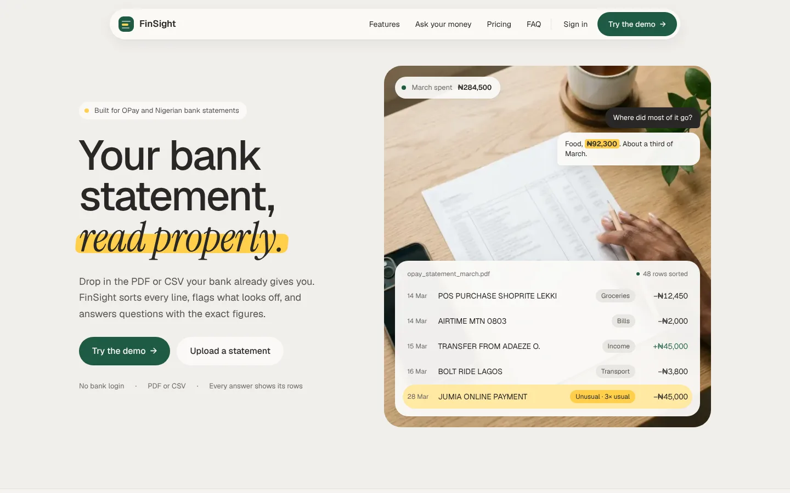
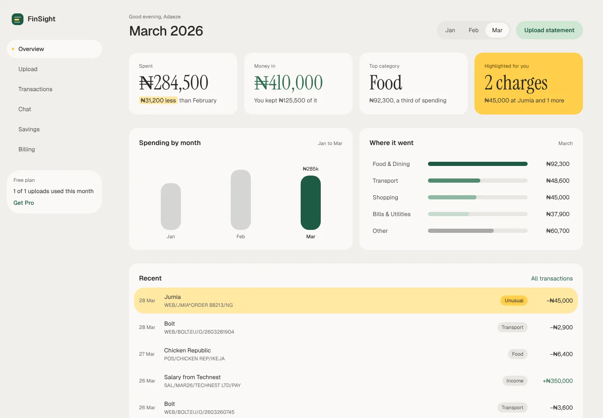
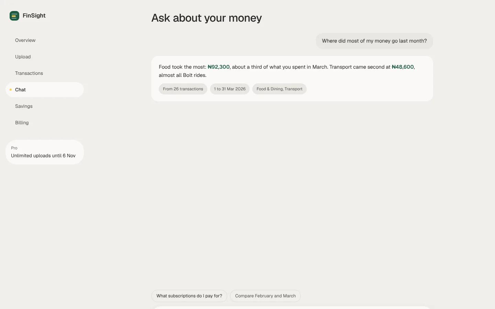
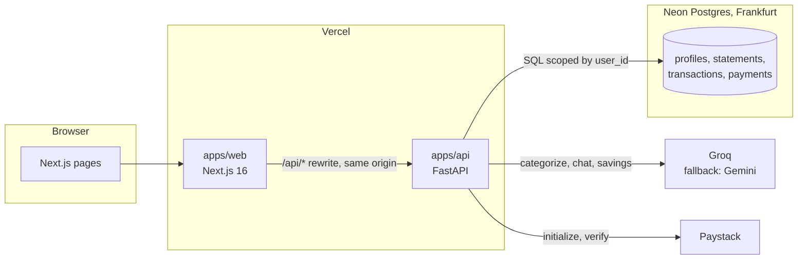

# FinSight

Reads the PDF or CSV statement your Nigerian bank or OPay wallet already gives you, sorts every line, highlights unusual charges and answers questions about your money with exact figures.

[](https://github.com/Elisabeth56/FinSight/actions/workflows/ci.yml)



**Live demo:** goes up with the deploy ([#18](https://github.com/Elisabeth56/FinSight/issues/18)) · **Case study:** [docs/case-study.md](docs/case-study.md) · **Design decisions:** [docs/decisions](docs/decisions)

## The problem

Most Nigerian banks and wallets don't connect to budgeting apps, so tools built on Plaid-style bank links never reach the people using them. What everyone does have is a statement export, and it's written for the bank's systems: `TRF/NIP/FBN/OKONKWO C/09203941` tells you very little about where the month went.

## What it does

- **Reads statements:** CSV exports and PDFs, including OPay's layout where narrations wrap across lines. No bank login.
- **Sorts every line** into twelve plain categories and gives it a readable name ("Transfer to C. Okonkwo").
- **Highlights the odd one:** a charge far above your usual for that category gets marked as it lands.
- **Shows the month:** spent, money in, top category, six months side by side, recent rows.
- **Answers questions** like "How much did I spend on Bolt in the last 3 months?" with figures added up by the database, and links each answer to the rows behind it.
- **Savings report (Pro):** a few specific cuts with the naira worked out from your own rows. Pro is a one-time pass in NGN or USD through Paystack.

| Overview | Chat |
|---|---|
|  |  |

## How it works



1. The browser only talks to the web app. `/api/*` is rewritten to the FastAPI deployment, so there's no CORS.
2. **Upload:** parse the file (pandas, pdfplumber), dedupe narrations, categorize the unique ones in batches, flag anomalies against 90 days of history, and insert everything in one transaction.
3. **Chat:** a small model turns the question into filters (dates, category, merchant). SQL computes the totals and fetches the matching rows. The answer model streams over SSE using only those numbers, and the stream ends with the sources the UI shows as chips.
4. **Savings:** SQL averages 90 days of spending; the model picks which category or merchant to cut and by what share; code works out the naira.

More detail, including the data model and capacity maths, is in [docs/architecture.md](docs/architecture.md).

## Engineering decisions

- **The model never does arithmetic.** Every figure on screen or in a chat answer comes from SQL; the model only picks filters and words. Alternative: let the model read rows and sum them. It's simpler, but it gets totals wrong often enough to matter on a money app.
- **Dedupe before categorizing.** Nigerian statements repeat the same narrations (Bolt, airtime, POS at the same shop). Categorizing unique narrations and mapping results back cuts LLM calls by roughly two thirds, which keeps a 600-row statement inside Groq's free per-minute limit. Alternative: one call per row or per fixed batch.
- **Money as signed integer kobo, totals per currency.** The old schema stored amounts as text and added NGN to USD. Now `amount_minor bigint` and every summary groups by currency.
- **One-time Pro passes with `pro_until`.** Subscriptions meant webhooks, renewals and a plan flag that never got reset. A pass extends `pro_until`, verification is idempotent by reference, and expiry needs no cron ([ADR 005](docs/decisions/005-payments.md)).
- **Postgres on Neon, plain SQL, no ORM.** The data is relational and the queries are aggregates; psycopg and hand-written SQL keep them readable and testable against a real database ([ADR 001](docs/decisions/001-database.md)).

## AI quality

Three golden sets in [`evals/`](evals), scored by one script (`pnpm eval`). Groq is the primary provider; Gemini answers only when Groq is rate-limited or down.

| Suite | Cases | Metric | Groq (7 Oct 2026) | Gemini, earlier run |
|---|---|---|---|---|
| Parsing | GTBank CSV, Access CSV, OPay-style PDF | rows, total and currency exact | 3 / 3 files | 3 / 3 files |
| Categorization | 102 labelled Nigerian narrations | category right / readable name kept | 94 / 102 · 100 / 102 | 102 / 102 · 102 / 102 |
| Chat | 25 answerable + 5 unanswerable questions on the demo data | amount matches SQL, or no amount given | 29 / 30 | 29 / 30 |
| Chat latency | full streamed answer | p50 / p95 | 1.7 s / 2.4 s | 2.2 s / 3.4 s |

Models: on Groq, `gpt-oss-120b` for categorization and answers and `gpt-oss-20b` for chat intent, both at low reasoning effort. On Gemini, 3.5 Flash-Lite for both roles.

What the runs found:
- **First run (Gemini).** Three problems, all fixed in the same change:
  - Gemini spent its token budget on reasoning and cut JSON answers off mid-object.
  - The intent model read "March" as March of last year when the data ended part-way through March.
  - Streaming subscriptions landed in Entertainment instead of Bills.
- **Groq rerun.**
  - Groq had retired both Llama 3.x models, so every call failed over to the fallback.
  - On gpt-oss, chat first scored 24 / 30. The small model's reasoning ran past the 200-token intent limit, and it guessed a category next to a merchant ("DStv" filtered to Entertainment). A bigger token budget and two prompt rules brought it back to 29 / 30.
  - Categorization is still below Gemini. Incoming transfers from people land in Transfers instead of Income, and a few one-off places ("Slot", "Rufus & Bee") get the next-closest category. Raising reasoning effort made it worse, because a batch ran out of tokens.
- **The one chat miss.** "Bolt in the last 3 months" came back as ₦94,800 instead of ₦135,800. The small model started the window at the beginning of February, which drops January's rides. It gets the window right when run alone, so this is run-to-run variance in date resolution.

Free-tier limits (October 2026):
- Groq: 1,000 requests a day and 8,000 tokens a minute per model.
- Gemini: 3.5 Flash allows 20 requests a day, so Flash-Lite is the fallback.

CI runs the parsing suite on every pull request. Full results are in [`evals/results/baseline.json`](evals/results/baseline.json).

## Tech stack

- **Frontend:** Next.js 16 and React 19 for the app router and server rendering; Tailwind v4 with the FinSight design tokens; Motion for the highlighter swipe and count-ups (all off under reduced motion).
- **Backend:** FastAPI on Python 3.12, because parsing and the AI pipeline need pandas and pdfplumber. uv, ruff and pyright.
- **Data:** Neon Postgres (free tier that doesn't pause the project away), psycopg 3, numbered SQL migrations.
- **AI:** Groq (gpt-oss-120b for answers and categorization, gpt-oss-20b for intent) with Gemini's free tier as the fallback, through one small module with timeouts and a 429 retry.
- **Payments:** Paystack, which takes naira cards and transfers.
- **Infra:** Vercel for both apps, GitHub Actions for lint, typecheck, tests and the parsing eval.

## Run locally

You need Node 22 with pnpm, Python 3.12 with [uv](https://docs.astral.sh/uv/), and Postgres 16 (local, or a Neon branch).

```bash
pnpm install
(cd apps/api && uv sync)
cp apps/web/.env.example apps/web/.env.local
cp apps/api/.env.example apps/api/.env        # set DATABASE_URL; AI and Paystack keys are optional
pnpm db:migrate && pnpm db:seed               # schema plus the demo account's three months
pnpm dev                                      # web on :3000, API on :8000
```

Checks, as CI runs them:

```bash
pnpm lint && pnpm typecheck
TEST_DATABASE_URL=postgresql://localhost/finsight_test pnpm test   # a scratch database
pnpm eval                                                           # parsing only, unless an AI key is set
```

Without `GROQ_API_KEY` or `GEMINI_API_KEY`, uploads still work and every row lands in Other; chat and the savings report say the AI is busy.

## Limitations and next steps

- Sign-in moves to Neon Auth with Google and email ([#6](https://github.com/Elisabeth56/FinSight/issues/6)); until then you can't sign in locally, and the demo account is reached through the seed.
- Scanned (image-only) PDFs aren't read. The app says so and suggests the CSV export.
- Anomaly detection is a per-category z-score. It catches a ₦45,000 Jumia order in a month of ₦15,000 ones, but not a slow creep.
- One currency per statement: a statement that mixes currencies is read as a single one.

## Author

Elisabeth Nnamani · [GitHub](https://github.com/Elisabeth56) · [nnamanielisabeth@gmail.com](mailto:nnamanielisabeth@gmail.com)
