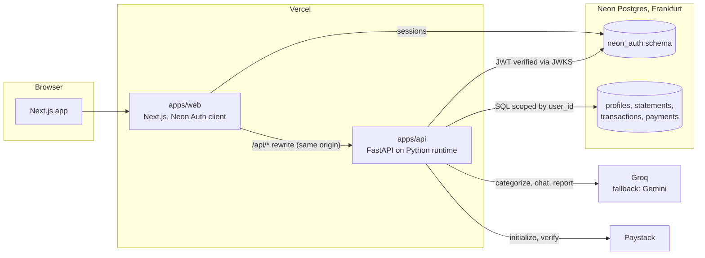

# FinSight architecture

FinSight reads the bank statements people in Nigeria already have (CSV or PDF exports, including OPay's) and turns them into categorized spending, monthly trends, unusual-charge alerts and a chat you can ask about your money. It needs no bank login or bank API, which is what keeps tools like Plaid out of reach for most Nigerian users.

## Requirements

**Core use cases**
1. Sign in with Google or email, or try a seeded demo account without signing up.
2. Upload a CSV or PDF statement. Get every row parsed, categorized and checked for anomalies.
3. See this month's spend and income, a 6-month trend, and spend by category.
4. Browse and search transactions by month, category and text.
5. Ask questions in chat ("Where did most of my money go in March?") and get answers with exact numbers.
6. Generate a savings report (Pro).
7. Pay for Pro in NGN or USD.

**Non-functional**
- Numbers shown to the user are always computed in SQL or code, never by the model.
- Upload of a typical statement (100–600 rows) finishes in under 60s. Chat starts streaming in under 2s.
- Mobile-first, and usable on slow connections.
- Free tiers only. Nothing that pauses or deletes the project after a week of inactivity (that is how the Supabase project was lost).
- Portfolio scale: tens of real users plus demo traffic.

## Data shape and access patterns

| Table | Shape | Main reads / writes |
|---|---|---|
| `neon_auth.*` | Managed by Neon Auth (users, sessions, accounts) | Sign in, session checks |
| `profiles` | `id` (= auth user id), `email`, `full_name`, `pro_until timestamptz null` | Read on every API request (plan check). Written on first sign-in and on payment |
| `statements` | `id`, `user_id`, `filename`, `file_type`, `file_sha256`, `status`, `error`, `currency`, `period_start`, `period_end`, `row_count`, `created_at` | Insert per upload. Count this month's uploads (free quota). Unique `(user_id, file_sha256)` rejects re-uploads of the same file |
| `transactions` | `id`, `user_id`, `statement_id` (cascade), `transaction_date date`, `description`, `amount_minor bigint` (signed, kobo/cents), `currency char(3)`, `category` (check: 12 values), `category_source`, `is_anomaly`, `raw jsonb`, `created_at` | Bulk insert per upload (100–600 rows). Read by user + date range, user + category, user + text search. Monthly and category sums |
| `payments` | `id`, `user_id`, `reference` unique, `plan_id`, `amount_minor`, `currency`, `status`, `paid_at`, `payload jsonb` | Insert on initialize, update on verify. Idempotent by `reference` |

Indexes: `transactions (user_id, transaction_date desc)`, `transactions (user_id, category, transaction_date)`, trigram GIN on `transactions.description` for text search.

Every query is scoped by `user_id` in the SQL itself. The browser never talks to the database, so access control lives in the API (see ADR 001).

**Changes from the old schema and why**
- `amount numeric` as text → `amount_minor bigint`. Integer money, no float or string round trips.
- `users.plan = 'pro'` → `profiles.pro_until`. Pro is active while `pro_until > now()`, so expiry is enforced by the data instead of a missing cron.
- `subscriptions` + `payment_events` → `payments`, because recurring subscriptions are dropped (ADR 005).
- Totals per currency. Summaries group by `currency`, so NGN and USD are never added together.

## Capacity (back of envelope)

- 50 users × 3 statements × 300 rows = 45k transaction rows a year, about 30 MB with indexes. Neon free gives 1 GB per project.
- The real limit is the LLM. Groq's free tier allows about 12k tokens per minute on the 70B model. A 600-row statement in 40-row batches is about 15 calls and 20k+ tokens, so a single upload could hit the limit. Deduplicating repeated descriptions before categorizing (ADR 004) cuts this to roughly a third on real Nigerian statements, which repeat "POS PURCHASE", transfers and airtime constantly.
- What breaks first at 10x: LLM rate limits, then Neon's 100 CU-hours a month. Both show up in logs before users notice.

## Architecture

**Upload flow:** browser → `POST /api/statements` → parse (pdfplumber/pandas) → dedupe descriptions → categorize in batches → anomaly z-scores against 90 days of history → bulk insert in one transaction → return summary.

**Chat flow:** question → intent extraction (small model, JSON) → SQL builds exact totals and the matching rows → answer model streams over SSE using only those numbers.

## Known risks and how we find out early

| Risk | Check |
|---|---|
| FastAPI can't verify Neon Auth sessions cleanly | Spike passed (Oct 7): Neon Auth issues EdDSA JWTs that FastAPI verifies against the JWKS URL (ADR 002) |
| SSE through the Next.js rewrite gets buffered | Spike: stream 20 tokens through the rewrite and time each |
| pandas + pdfplumber bundle exceeds Vercel's Python limit (500 MB) | First preview deploy; removing LlamaIndex already saves a lot |
| Statements over 4.5 MB (Vercel request body limit) | Cap uploads at 4 MB with a clear message; log rejected sizes |
| Groq rate limits during demos | Demo account is pre-seeded, so viewing it makes no LLM calls; Gemini fallback on 429 |
